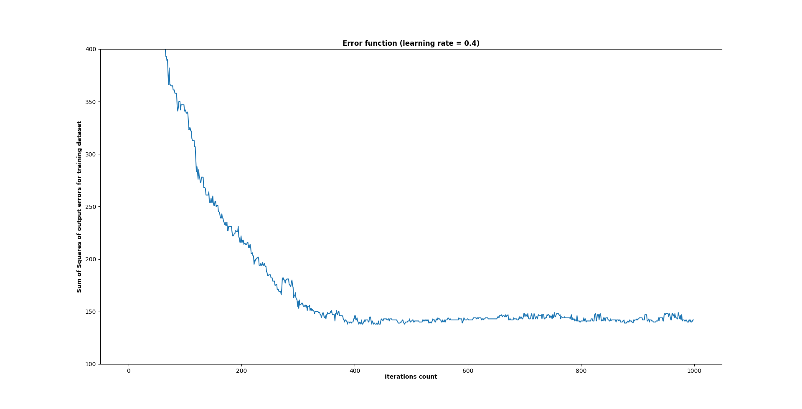

# Multilayer Perceptron Neural Network

## Disclaimer
This app provides only information for educational purposes. This app is not medical or treatment advice, professional diagnosis, opinion, or services – and may not be treated as such by the user. As such, this app may not be relied upon for the purposes of medical diagnosis or as a recommendation for medical care or treatment. The information provided by this app is not a substitute for professional medical advice, diagnosis or treatment.

## General
Multilayer perceptron with backpropagation algorithm, implemented from stratch. Project developed for Neural Networks in Biomedicine course at the WUT.

## Architecture
Neural network is represented by *NeuralNetwork* object and it allows to maniupalate nn, e.g. set structure, learning params, start learning/testing process based on the specified dataset. *Layer* object represents the neural network layer (hidden or output) and allows to set layer params (inputs count, neurons/outputs count, activation function, bias). Every *Layer* object has weights matrix with *m x n* with weights for each input connection in the layer (*m-th* row contains *m-th* neuron inputs and *n-th* column contains *n-th* input in the layer). 

```
                                               BIAS         IN_1       IN_2     ...     IN_n
                                         ---                                                     ---
                        NEURON_1        |      w_1_0        w_1_1      w_1_2    ...     w_1_n       |
                                        |                                                           |
                        NEURON_2        |      w_2_0        w_2_1      w_2_2    ...     w_2_n       |
                                        |                                                           |
                          ...           |       ...         ...        ...      ...      ...        |
                                        |                                                           |
                        NEURON_m        |      w_3_0        w_m_1      w_m_2    ...     w_m_n       |
                                         ---                                                     ---
```

## Dataset
The source of the data to train and test the network is [Elter,Matthias. (2007). Mammographic Mass. UCI Machine Learning Repository](https://doi.org/10.24432/C53K6Z). Missing cell values were filled with the median of the column in which the cell is missing. The dataset was divided in a proportion ~70:30 for traning and testing data.

## Results
For the structure given below and the learning rate of 0.4 the accuracy is ~0.75, the specificity ~0.71 and the sensitivity ~0.82.
Example error functions in the learning process are given below.

### Network scheme


### Example error functions



